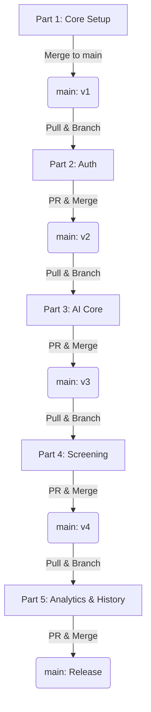

# RecruitAI — Collaborative Backend Integration Plan

This document outlines how to split and build the **RecruitAI Backend** in 5 logical, sequential parts. By partitioning the codebase this way, your team members can work collaboratively on Git, commit their respective parts, and build a clean, distributed contribution history.

---

## 👥 Git Collaboration Strategy

To ensure everyone gets full contributor credit on GitHub without dealing with merge conflicts:
1. **Initialize**: **Contributor 1** initializes the repository with the foundation (Part 1) directly on the `main` branch.
2. **Branching**: Each subsequent contributor will:
   - Run `git checkout main` and `git pull` to fetch the latest merged code.
   - Create a feature branch: `git checkout -b feature/part-X` (e.g., `feature/part-2-auth`).
   - Copy their assigned files into the project structure.
   - Commit and push their branch: `git push origin feature/part-X`.
   - Open a Pull Request (PR) on GitHub.
3. **Merge**: Once reviewed/tested, merge the PR into `main`. The next contributor then pulls `main` and repeats the process.



---

## 🗄️ Database Setup (Supabase / PostgreSQL)

Before starting the server, run the following SQL scripts in your Database SQL Editor (e.g., Supabase dashboard) to establish the tables.

```sql
-- 1. Create app_users table
CREATE TABLE app_users (
    id SERIAL PRIMARY KEY,
    email VARCHAR(255) UNIQUE NOT NULL,
    password_hash VARCHAR(255) NOT NULL,
    name VARCHAR(255),
    created_at TIMESTAMP WITH TIME ZONE DEFAULT CURRENT_TIMESTAMP
);

-- 2. Create screening_sessions table
CREATE TABLE screening_sessions (
    id UUID PRIMARY KEY DEFAULT gen_random_uuid(),
    user_id INTEGER NOT NULL REFERENCES app_users(id) ON DELETE CASCADE,
    title VARCHAR(255) NOT NULL,
    jd JSONB NOT NULL,
    candidates JSONB NOT NULL,
    bias_report JSONB,
    interviews JSONB DEFAULT '{}'::jsonb,
    candidate_count INTEGER NOT NULL,
    created_at TIMESTAMP WITH TIME ZONE DEFAULT CURRENT_TIMESTAMP
);
```

---

## 📦 Part-by-Part Code Breakdown

### Part 1: Core Setup, Database & Middleware Setup (The Backbone)
* **Goal**: Initialize the project structure, server configuration, database connections, and basic security middleware.
* **Assigned To**: **Contributor 1**
* **Files to Commit**:
  * [package.json](file:///c:/Users/Mohit-PC/2ndYear/Recuritment-platform/backend/package.json)
  * [package-lock.json](file:///c:/Users/Mohit-PC/2ndYear/Recuritment-platform/backend/package-lock.json)
  * [.env.example](file:///c:/Users/Mohit-PC/2ndYear/Recuritment-platform/backend/.env.example)
  * [.gitignore](file:///c:/Users/Mohit-PC/2ndYear/Recuritment-platform/backend/.gitignore)
  * [config/env.js](file:///c:/Users/Mohit-PC/2ndYear/Recuritment-platform/backend/config/env.js)
  * [db/pool.js](file:///c:/Users/Mohit-PC/2ndYear/Recuritment-platform/backend/db/pool.js)
  * [middleware/error.middleware.js](file:///c:/Users/Mohit-PC/2ndYear/Recuritment-platform/backend/middleware/error.middleware.js)
  * [server.js](file:///c:/Users/Mohit-PC/2ndYear/Recuritment-platform/backend/server.js) *(Create a clean skeleton version shown below)*

#### Skeleton `server.js` (Part 1 Version)
```javascript
import 'express-async-errors';
import express from 'express';
import cors from 'cors';
import helmet from 'helmet';
import morgan from 'morgan';
import { config, logProviderStatus } from './config/env.js';
import { pingDb } from './db/pool.js';
import { errorMiddleware } from './middleware/error.middleware.js';

const app = express();
const PORT = config.port;

app.use(helmet({ crossOriginResourcePolicy: { policy: 'cross-origin' } }));
app.use(morgan('dev'));
app.use(cors({
  origin: config.corsOrigin,
  methods: ['GET', 'POST', 'PUT', 'DELETE', 'OPTIONS'],
  allowedHeaders: ['Content-Type', 'Authorization'],
  credentials: true,
}));
app.use(express.json({ limit: '10mb' }));
app.use(express.urlencoded({ extended: true, limit: '10mb' }));

app.get('/api/health', (_req, res) => {
  res.json({ success: true, message: 'RecruitAI backend is running' });
});

app.use(errorMiddleware);

app.listen(PORT, async () => {
  console.log(`🚀 RecruitAI backend running on port ${PORT}`);
  logProviderStatus();
  const ok = await pingDb();
  console.log(`   DB ping: ${ok ? '✅ reachable' : '⚠️  unreachable'}`);
});

export default app;
```

* **Verification**: Run `npm install` followed by `npm run dev`. The console should output that the server is running and database is reachable.

---

### Part 2: Authentication & Session Protection (Security)
* **Goal**: Implement user registration, login, token signing, and session guarding.
* **Assigned To**: **Contributor 2**
* **Files to Commit**:
  * [middleware/auth.middleware.js](file:///c:/Users/Mohit-PC/2ndYear/Recuritment-platform/backend/middleware/auth.middleware.js)
  * [services/auth.service.js](file:///c:/Users/Mohit-PC/2ndYear/Recuritment-platform/backend/services/auth.service.js)
  * [controllers/auth.controller.js](file:///c:/Users/Mohit-PC/2ndYear/Recuritment-platform/backend/controllers/auth.controller.js)
  * [routes/auth.routes.js](file:///c:/Users/Mohit-PC/2ndYear/Recuritment-platform/backend/routes/auth.routes.js)

#### Updates to `server.js` (Part 2)
Add the import and route mount under line 12:
```javascript
// Imports:
import authRoutes from './routes/auth.routes.js';

// Route mount:
app.use('/api/auth', authRoutes);
```

* **Verification**: Use Postman/Thunder Client to POST to `/api/auth/signup` and `/api/auth/login`. Verify that a valid JWT token is returned, and that a GET request to `/api/auth/me` returns the user details when the token is passed in the headers.

---

### Part 3: LLM Gateway & File Parsers (AI Integration)
* **Goal**: Establish the core AI utility system, including models chain setup, rate-limit fallback handler, prompt configurations, and document parsing engine (`pdf-parse`, `mammoth`).
* **Assigned To**: **Contributor 3**
* **Files to Commit**:
  * [middleware/upload.middleware.js](file:///c:/Users/Mohit-PC/2ndYear/Recuritment-platform/backend/middleware/upload.middleware.js)
  * [services/prompts.js](file:///c:/Users/Mohit-PC/2ndYear/Recuritment-platform/backend/services/prompts.js)
  * [services/llm.service.js](file:///c:/Users/Mohit-PC/2ndYear/Recuritment-platform/backend/services/llm.service.js)
  * [services/openrouter.service.js](file:///c:/Users/Mohit-PC/2ndYear/Recuritment-platform/backend/services/openrouter.service.js)
  * [services/parser.service.js](file:///c:/Users/Mohit-PC/2ndYear/Recuritment-platform/backend/services/parser.service.js)

* **Verification**: No routes are exposed directly yet, but you can write a temporary file test or check that the package integrations compile with no errors.

---

### Part 4: Resume Parsing & Candidate Scoring Pipeline (Core Business Logic)
* **Goal**: Expose endpoints to parse job descriptions, upload multiple CVs, and kick off the real-time background candidate scoring progress via Server-Sent Events (SSE).
* **Assigned To**: **Contributor 4**
* **Files to Commit**:
  * [controllers/jd.controller.js](file:///c:/Users/Mohit-PC/2ndYear/Recuritment-platform/backend/controllers/jd.controller.js)
  * [routes/jd.routes.js](file:///c:/Users/Mohit-PC/2ndYear/Recuritment-platform/backend/routes/jd.routes.js)
  * [controllers/cv.controller.js](file:///c:/Users/Mohit-PC/2ndYear/Recuritment-platform/backend/controllers/cv.controller.js)
  * [routes/cv.routes.js](file:///c:/Users/Mohit-PC/2ndYear/Recuritment-platform/backend/routes/cv.routes.js)
  * [controllers/score.controller.js](file:///c:/Users/Mohit-PC/2ndYear/Recuritment-platform/backend/controllers/score.controller.js)
  * [routes/score.routes.js](file:///c:/Users/Mohit-PC/2ndYear/Recuritment-platform/backend/routes/score.routes.js)

#### Updates to `server.js` (Part 4)
Expose the in-memory SSE job store and mount routes:
```javascript
// Add export near the top (e.g., line 20):
export const sseJobStore = new Map();

// Imports:
import jdRoutes from './routes/jd.routes.js';
import cvRoutes from './routes/cv.routes.js';
import scoreRoutes from './routes/score.routes.js';

// Route mounts:
app.use('/api/jd', jdRoutes);
app.use('/api/cv', cvRoutes);
app.use('/api/score', scoreRoutes);
```

* **Verification**: Upload CV files to `/api/cv/parse-batch` and POST job descriptions to `/api/jd/parse`. Trigger a scoring job at `/api/score/batch` and read the event progress stream through `/api/score/progress/:jobId`.

---

### Part 5: Bias Checks, Interview Guide & Session History (Finished Product)
* **Goal**: Add endpoints to check CV shortlists for diversity/homogeneity bias, generate custom candidate-specific interview question guides, and persist the complete history of screening sessions in Supabase.
* **Assigned To**: **Contributor 5**
* **Files to Commit**:
  * [controllers/bias.controller.js](file:///c:/Users/Mohit-PC/2ndYear/Recuritment-platform/backend/controllers/bias.controller.js)
  * [routes/bias.routes.js](file:///c:/Users/Mohit-PC/2ndYear/Recuritment-platform/backend/routes/bias.routes.js)
  * [controllers/interview.controller.js](file:///c:/Users/Mohit-PC/2ndYear/Recuritment-platform/backend/controllers/interview.controller.js)
  * [routes/interview.routes.js](file:///c:/Users/Mohit-PC/2ndYear/Recuritment-platform/backend/routes/interview.routes.js)
  * [controllers/session.controller.js](file:///c:/Users/Mohit-PC/2ndYear/Recuritment-platform/backend/controllers/session.controller.js)
  * [routes/session.routes.js](file:///c:/Users/Mohit-PC/2ndYear/Recuritment-platform/backend/routes/session.routes.js)

#### Updates to `server.js` (Part 5 - Final)
Register the remaining routes:
```javascript
// Imports:
import biasRoutes from './routes/bias.routes.js';
import interviewRoutes from './routes/interview.routes.js';
import sessionRoutes from './routes/session.routes.js';

// Route mounts:
app.use('/api/bias', biasRoutes);
app.use('/api/interview', interviewRoutes);
app.use('/api/sessions', sessionRoutes);
```

* **Verification**: Run the backend end-to-end. Confirm that users can sign in, parse and score candidates, audit bias, get interview questions, and view/restore their saved sessions.

---

## 📈 Summary of Work Distribution

| Part | Phase | Contributor Role | Main Files | Key Deliverable |
| :--- | :--- | :--- | :--- | :--- |
| **1** | **Base Infrastructure** | Lead Setup Developer | `package.json`, `server.js`, `pool.js` | Express app structure connected to Supabase Postgres. |
| **2** | **Access Management** | Security Specialist | `auth.controller.js`, `auth.middleware.js` | Secure route guards and JWT sign-up/sign-in flows. |
| **3** | **Extraction Core** | AI Integrations Engineer | `llm.service.js`, `parser.service.js`, `prompts.js` | Resilient, multi-fallback LLM gateway and file parse engines. |
| **4** | **AI Screening Pipeline** | Backend Flow Architect | `cv.controller.js`, `score.controller.js` (SSE) | Multi-file CV parsing & asynchronous progress-metered scoring. |
| **5** | **Analytics & History** | Feature & Database Lead | `bias.controller.js`, `session.controller.js` | Shortlist homogeneity check, custom interview guides & history save/load. |
