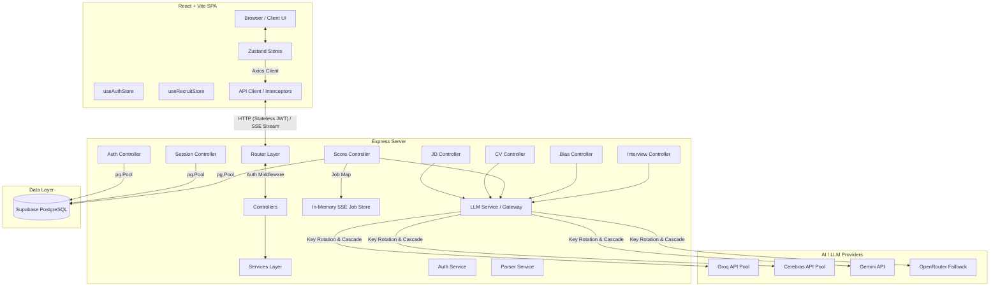

# RecruitAI — Project Presentation & Architecture Guide

This document serves as your master guide for presenting **RecruitAI**. It covers the complete architecture, step-by-step process flows, in-depth design rationale (the *why* and *how* behind key technical decisions), and a robust Q&A preparation section with potential questions you might be asked during a project defense, interview, or presentation.

---

## 📌 Executive Summary

**RecruitAI** is an end-to-end, AI-augmented candidate screening and recruitment platform designed to solve the bottlenecks of traditional resume screening. 
Instead of simple keyword matching, it leverages **semantic evaluation** to score and rank candidates against a job description. 

### Core Tech Stack
*   **Frontend**: React 18 (Vite) for rapid hot-reloading and build optimization, Zustand for lightweight and modular state management, and Vanilla CSS styled with a premium, modern dark glassmorphism theme.
*   **Backend**: Node.js (Express 5 with ES Modules), using `express-async-errors` for seamless asynchronous error handling.
*   **Database**: PostgreSQL (hosted on Supabase) utilizing a `pg.Pool` connection pooler (`Supavisor`) to ensure stable connectivity.
*   **AI Engine**: A resilient, custom Multi-Provider LLM Gateway with instant key rotation and fallback cascading across **Groq** (llama-3.1/3.3), **Cerebras** (gpt-oss-120b/zai-glm-4.7), **Gemini** (2.0 Flash), and **OpenRouter**.
*   **Real-time Stream**: Server-Sent Events (SSE) for unidirectional, low-overhead progress streaming.

---

## 🏗️ System Architecture & Data Flow



---

## 🔄 Step-by-Step Process Flows

Here is exactly how data moves through the platform's five core stages:

### 🔐 0. Authentication & Session Boot
```
[App Boot] ──► Checks LocalStorage for JWT token
                 │
                 ├──► Token Found: GET /api/auth/me ──► Validates ──► RESTORES user session
                 └──► Token Missing/Invalid ──► Redirects to AuthScreen (Signup/Login)
```
*   **How it works**: Uses stateless JWT authentication. Passwords are encrypted using `bcryptjs` on signup. Upon login, the server signs a token containing the user's ID and email, which is stored in the browser's `LocalStorage`. An Axios request interceptor attaches this token to the `Authorization: Bearer <token>` header of every subsequent request.

---

### 📝 Step 1: Job Description (JD) Parsing
```
[User Input: Raw JD Text] 
          │
          ▼
[POST /api/jd/parse]
          │
          ▼
[LLM Service: callAI] ──► Selects Fast-Tier Model (llama-3.1-8b-instant)
          │
          ▼
[AI Response: Raw Text] ──► Brace-Matching JSON Extractor
          │
          ▼
[Structured JD Object] ──► Saved in Zustand (parsedJD) ──► UI Renders Requirements Cards
```
*   **JSON Schema**: Extracts `title`, `company`, `hardSkills` (with `required` boolean), `softSkills`, `experienceLevel`, `minYearsExperience`, `domainKnowledge`, `mustHave` (key requirements), and a `summary`.

---

### 📄 Step 2: Resume (CV) Upload & Parsing
```
[User Drops PDF/DOCX Files] (Max 50 CVs)
          │
          ▼
[POST /api/cv/parse-batch] (multipart/form-data)
          │
          ▼
[Parser Service] ──► Extracts Raw Text (pdf-parse for PDF, mammoth for DOCX)
          │
          ▼
[LLM Service: callAI] ──► Parse Prompt ──► Structured Candidate Profile
          │
          ▼
[Zustand Store] ──► Updates parsedCandidates[] (or loadDemoCVs() loads mock profiles)
```
*   **Design Highlight**: To handle image-only PDFs, the backend checks if the extracted character count is under 100. If so, it returns a warning flag, allowing the UI to prompt the user to copy-paste the text manually rather than failing silently.

---

### ⚡ Step 3: Real-time Concurrency Scoring & SSE Pipeline
The scoring pipeline is the performance centerpiece of RecruitAI:

```
[User clicks "Score Candidates"]
          │
          ▼
[POST /api/score/batch]
          │
          ├──► Generates UUID jobId
          ├──► Creates Job entry in shared Map (sseJobStore)
          ├──► Returns { jobId } instantly (HTTP 200) to client
          └──► Kicks off processScoringJob(jobId) in background (async, no-await)
                 │
                 ▼
       [Split Candidates into Batches of 5] ──► pLimit(8) limits concurrent AI calls to 8
                 │
                 ├──► For each batch: Send JD once + 5 Candidate profiles (slimmed to save tokens)
                 │      ├──► AI responds with JSON scores
                 │      └──► If batch fails: Fallback to individual scoring (scoreOne)
                 │
                 ├──► Live Updates: broadcastSSE(jobId, { type: "progress", progress: X% })
                 │      └──► Client's EventSource receives event, updates Zustand progress bars
                 │
                 └──► All complete: Sort by overallScore DESC ──► Tag Top 10 shortlisted
                        └──► broadcastSSE(jobId, { type: "done", candidates: rankedCandidates })
```
*   **SSE Client Handshake**: The browser connects to `GET /api/score/progress/:jobId` using `EventSource`. The connection remains open. Once the `'done'` event is received, the frontend automatically closes the connection, transitions to the results dashboard, and kicks off Step 4 in the background.

---

### 🛡️ Step 4: Shortlist Bias Auditing & DB Auto-Save
Immediately after scoring finishes, the system secures candidate data and checks for biases:

```
[Scoring Done] ──► POST /api/bias/check ──► Send shortlist (top 10) + full ranked list
                         │
                         ▼
          [LLM Service: callAI] ──► Audits for homogeneity (education, gender indicators, traditional paths)
                         │
                         ▼
          [Bias Report Saved in Zustand] ──► If bias detected, warning banner is mounted in UI
                         │
                         ▼
          [Auto-Save Session] ──► POST /api/sessions ──► Insert into Supabase DB
```
*   **Supabase Session History**: Sessions are saved to the `screening_sessions` table. Users can reload previous screens (including JD, candidates, bias report, and interview guides) via the `HistoryPanel` slide-over, turning a single-session utility into a complete SaaS history tool.

---

### 💬 Step 5: Tailored Interview Guides
```
[User Selects Candidate] ──► Click "Generate Interview Guide"
                                  │
                                  ├──► Check Cache: interviewQuestions[name] exists?
                                  │      ├──► YES: Open drawer instantly (no API latency, no cost)
                                  │      └──► NO: POST /api/interview/questions
                                  │                 │
                                  │                 ▼
                                  │        [LLM Service: callAI] (Quality Tier)
                                  │        References specific CV entries (gaps, roles)
                                  │                 │
                                  │                 ▼
                                  │        [Cache & Save] ──► Store in Zustand + PATCH to DB
```
*   **Tailored Questions**: Generates exactly 12 questions across 4 categories (Technical, Behavioral, Gap-Probing, Culture), complete with difficulty levels, competencies, and rationales based on their actual background.

---

## 🛠️ Key Design Decisions: The "Why" and "How"

Here is a breakdown of why this architecture was chosen and how it works under the hood. Use this section to explain why these choices represent engineering best practices.

### 1. Server-Sent Events (SSE) over WebSockets or Polling
*   **The Problem**: Scoring multiple candidates takes time (10–30s depending on AI queues). Polling creates unnecessary HTTP overhead (spamming the backend), while WebSockets require full duplex setup, connection upgrades, ping/pong heartbeats, and complex server libraries (e.g. `ws` or `Socket.io`), which bloats the bundle.
*   **The Solution**: Server-Sent Events (SSE). 
*   **How it works**: SSE runs over standard HTTP (`Content-Type: text/event-stream`), keeping a unidirectional socket open from the server to the client. The server can push strings of text (structured as JSON events) down the line whenever progress occurs.
*   **Why it's best**: Unidirectional communication is all a progress tracker needs. It uses standard HTTP, is native to the browser (`EventSource`), automatically handles reconnects, is highly firewall-friendly, and uses minimal server resources.

### 2. Multi-Provider LLM Gateway with Key Rotation & Cascading Fallbacks
*   **The Problem**: Relying on a single free-tier API provider (like Groq) exposes the app to strict rate limits (e.g., 30 requests per minute or low token-per-minute caps) and temporary outages.
*   **The Solution**: A multi-provider LLM gateway (`llm.service.js`) that handles key rotation and fallback cascading.
*   **How it works**: 
    1.  **Key Pooling**: By passing a comma-separated string in `.env` (e.g. `GROQ_API_KEYS=key1,key2,key3`), the gateway builds a key pool. Each request increments a global cursor to route traffic across keys, spreading the rate-limit load across separate quotas.
    2.  **Cascading Fallback Chain**: If a request encounters a `429` (Rate Limit) or server failure, it immediately rotates keys or cascades to the next provider in the chain:
        $$\text{Groq} \longrightarrow \text{Cerebras} \longrightarrow \text{Google Gemini} \longrightarrow \text{OpenRouter (Moonshot/Kimi)}$$
    3.  **Tier Isolation**: The system separates requests into **Fast Tier** (cheap, fast models like `llama-3.1-8b-instant` for JD/CV parsing) and **Quality Tier** (smarter models like `llama-3.3-70b-versatile` or `gpt-oss-120b` for scoring and bias checks). Because rate limits are model-specific, isolating tiers effectively doubles throughput.

### 3. Resilient Brace-Matching JSON Parser
*   **The Problem**: LLM models (especially reasoning models like Cerebras' `gpt-oss-120b` or Google Gemini) frequently prepend chat filler (e.g. *"Here is your JSON response:"*) or expose internal thought blocks before outputting their JSON object. Calling `JSON.parse()` on this output throws a syntax error and crashes the flow.
*   **The Solution**: A custom, brace-matching scanner.
*   **How it works**: If a fast-path direct parse fails, the `safeParseJSON` helper scans the text. It ignores text outside the outermost matching brackets `{}` or `[]`, and skips any braces that appear inside double quotes (to handle nested strings). Once it finds a balanced block, it cuts out the substring and parses it.
*   **Why it's best**: It guarantees that the backend won't crash if the LLM adds introductory filler or if a reasoning model prints its thoughts.

### 4. Concurrency Control (`pLimit`) & Token Optimization
*   **The Problem**: Triggering 50 parallel API requests to score 50 resumes simultaneously will immediately trigger `429` errors due to token-per-minute limits. However, processing them sequentially (one by one) is too slow.
*   **The Solution**: Combination of **batching**, **payload slimming**, and **concurrency control**.
*   **How it works**:
    1.  **Batching**: The controller chunks candidates into batches of 5. Instead of sending the JD and prompt text 5 separate times, it sends them once per batch alongside the 5 candidate profiles. This reduces input token consumption by roughly 35%.
    2.  **Payload Slimming**: The controller strips out phone numbers, emails, and raw resume highlight paragraphs before sending the data to the LLM. Only semantic signals (skills, roles, years of experience, career trajectory) are sent. This slims the payload by 40% and keeps the model well under its token limits.
    3.  **Concurrency Control**: Using `p-limit`, the backend caps simultaneous active requests at 8 (`MAX_CONCURRENT_AI_CALLS`). This provides a fast response time while keeping the server under rate limits. If a batch call fails, the system automatically falls back to rescoring those candidates individually.

### 5. In-Memory Job Store with Database Auto-Save
*   **The Problem**: Logging every incremental scoring percentage update to a PostgreSQL database creates massive write overhead. However, keeping all session data only in client memory means users lose their entire work history if they refresh their browser.
*   **The Solution**: A hybrid storage architecture.
*   **How it works**:
    1.  During active scoring, the job's intermediate progress (e.g. `X/Y candidates completed`) is written only to an in-memory `Map` (`sseJobStore`) on the server.
    2.  The client listens to this progress via SSE.
    3.  Once the job finishes, the client triggers the bias audit and auto-saves the complete, finalized session to PostgreSQL (Supabase) in a single write operation.
*   **Why it's best**: It eliminates database query overhead during processing, but guarantees full persistence of the screening history, which can be reloaded at any time.

---

## 👩‍💻 Presentation Q&A Preparation: How to Answer Like a Pro

Here are the questions a reviewer or interviewer is most likely to ask, along with structured, expert-level answers.

### 🌐 Category A: Real-Time Communication & Streaming (SSE)

#### Q1: "Why did you choose Server-Sent Events (SSE) over WebSockets for the live scoring progress bar?"
> **Expert Answer:** 
> "WebSockets are designed for full-duplex, bi-directional communication, which is perfect for real-time multiplayer games or chat apps. However, for a candidate scoring pipeline, the communication is purely unidirectional: the client requests scoring once, and the server pushes updates as candidates complete. 
> 
> SSE is built on top of standard HTTP (`text/event-stream`), making it lightweight and simple to implement without adding heavy websocket libraries. It supports automatic reconnection out of the box, handles firewalls/proxies without protocol negotiation, and has a smaller memory footprint on the server. It was the pragmatically correct choice for this unidirectional update flow."

#### Q2: "What happens if a user closes their browser or loses internet connection mid-way through scoring?"
> **Expert Answer:** 
> "When the client disconnects, the Express server detects the `'close'` event on the request stream and removes the response object from the job's active client array. However, the scoring process itself continues executing in the background on the server. 
> 
> When the user reconnects, they can pull the job status. If they don't reconnect, the server finishes the job, and the in-memory entry is automatically garbage-collected after 5 minutes using a `setTimeout` cleaner in the controller to prevent memory leaks."

---

### 🧠 Category B: AI Integration, Resilience & Gateway Logic

#### Q3: "Free AI endpoints (like Groq) are notoriously unstable and have low rate limits. How does your app ensure it doesn't break when screening 20 candidates?"
> **Expert Answer:** 
> "We solved this resiliency problem with three techniques:
> 1. **Key Rotation Pool**: The backend reads a comma-separated pool of API keys from the environment variables. For each AI call, we increment a cursor and rotate the key, distributing requests across different developer accounts and increasing our rate-limit budget.
> 2. **Model Cascading**: If an API key or provider fails (e.g., with a 429 rate limit or 5xx server error), the gateway immediately catches the error, rotates the key, or falls back to the next provider in the chain (Groq → Cerebras → Gemini → OpenRouter).
> 3. **Batching & Slimming**: We group candidates into batches of 5 to send the Job Description once instead of 5 times, saving input tokens. We also strip out non-essential data (such as emails, phone numbers, and formatting text) to reduce token size by 40%, keeping our requests well under token limits."

#### Q4: "How does the platform handle unstructured resume formats and ensure the AI returns valid data we can display in the UI?"
> **Expert Answer:** 
> "First, we use system prompts that mandate JSON outputs and provide an explicit schema structure. Second, we configure the API call with `response_format: { type: 'json_object' }` on providers that support JSON mode. 
> 
> Finally, to handle edge cases where models print conversational filler (e.g. *'Here is the candidate profile:'*) before the JSON, we built a custom **brace-matching parser**. It scans the response, matches the first opening brace `{` or `[` to its closing pair while ignoring braces inside quotes, and extracts only the valid JSON substring. This prevents syntax errors from breaking the frontend."

#### Q5: "How does the semantic evaluation differ from traditional keyword matching, and how do you prevent the AI from making up information?"
> **Expert Answer:** 
> "Traditional systems search for exact keywords (e.g., searching for 'React' but missing a candidate who has 'Frontend Engineer with Vue & Angular' experience). Our semantic evaluator evaluates transferable skills and matching career paths. 
> 
> To prevent AI hallucinations, the system prompts explicitly instruct the model to base scores *only* on the candidate's provided details. If a category (like education or domain knowledge) lacks data, the model is instructed to score it lower rather than assuming or inferring details. This keeps evaluations grounded in the actual resumes."

---

### 💾 Category C: Database, State & Security

#### Q6: "Why did you choose a stateless JWT auth system, and how does the client maintain their session after a refresh?"
> **Expert Answer:** 
> "Stateless JWT auth removes the need to query a sessions table in the database for every API request, reducing server latency. Once the user is verified during login, they receive a signed JWT token containing their ID and email. 
> 
> The client stores this token in `LocalStorage`. On application startup, our Zustand store runs an `init()` method that checks for the token. If found, it calls a lightweight `/api/auth/me` endpoint to restore the user session. Our Axios instance uses an interceptor to automatically attach the token as a Bearer header to all outgoing requests."

#### Q7: "If the JWT token is stateless, how do you handle security for protected routes like retrieving user history?"
> **Expert Answer:** 
> "We implement a custom Express middleware (`auth.middleware.js`). For protected routes (like `/api/sessions`), this middleware extracts the Bearer token from the `Authorization` header, validates it using the server's private `JWT_SECRET`, and extracts the payload. 
> 
> The user's ID is then attached directly to the request object (`req.user = { id: payload.id }`). This ensures that database queries only pull data belonging to the authenticated user, preventing cross-user data leakage."

---

### 🎨 Category D: Frontend Design & UI/UX

#### Q8: "How does the Zustand state store handle complex steps and the integration of the interview questions drawer?"
> **Expert Answer:** 
> "We split our frontend state into two distinct Zustand stores: `useAuthStore` for user sessions, and `useRecruitStore` for the screening workflow. This separation of concerns keeps state changes predictable. 
> 
> For the interview questions drawer, when a user requests a guide, the store first checks if the candidate's guide is cached in the `interviewQuestions` state object. If it exists, the drawer opens instantly. If not, it requests the guide from the API, caches the result, and opens the drawer. This caching avoids redundant API requests and loading indicators."

#### Q9: "What design system or styles did you use for the UI, and how did you implement the dashboard animations?"
> **Expert Answer:** 
> "We designed a dark glassmorphism theme using Vanilla CSS. Theme tokens (colors, border-radii, spacing, shadows, and transitions) are defined as CSS variables under the `:root` scope. 
> 
> We used custom fonts (`Inter` and `Berkeley Mono`/`JetBrains Mono`) for a modern feel. Animations like the loading ring, shimmer, and slide-in transitions are powered by CSS `@keyframes` (`fade-in`, `slide-in-right`, `pulse-ring`). This approach delivers a premium, responsive look without the weight of heavy UI libraries."
